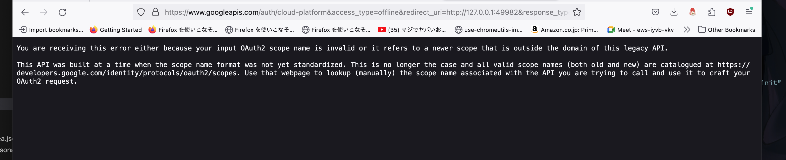

前回の続きです。

https://github.com/dermesser/yup-oauth2/blob/master/examples/custom_client.rs

これ動かせたらできそう

これを動かすためにとりあえずローカルに持ってきまして実行しました。

https://github.com/u-na-gi/yup-oauth2-custom-client


どうやらサービスアカウントが必要っぽいので作成します。

<br>

## サービスアカウントを作成する

IAMと管理 -> サービスアカウントを開いてアカウントとキーを作成します。
キーはダウンロードしたら任意の場所に置いて環境変数にパスをセットします。

<br>

## サービスアカウントを使ってoauth2認証を行う

先ほど作ったこれを使います。
https://github.com/u-na-gi/yup-oauth2-custom-client

先ほど作って落としてきたサービスアカウントキーを環境変数に渡します。


```shell
❰yuunag1❙~/development/yup-oauth2-custom-client(git✱main)❱✔≻ cargo run
   Compiling yup-oauth2-custom-client v0.1.0 (/Users/yuunag1/development/yup-oauth2-custom-client)
    Finished dev [unoptimized + debuginfo] target(s) in 4.59s
     Running `target/debug/yup-oauth2-custom-client`

-----------
response: Response { status: 200, version: HTTP/2.0, headers: {"accept-ranges": "bytes", "age": "369796", "cache-control": "max-age=604800", "content-type": "text/html; charset=UTF-8", "date": "Tue, 05 Mar 2024 17:53:11 GMT", "etag": "\"3147526947\"", "expires": "Tue, 12 Mar 2024 17:53:11 GMT", "last-modified": "Thu, 17 Oct 2019 07:18:26 GMT", "server": "ECS (laa/7AA3)", "vary": "Accept-Encoding", "x-cache": "HIT", "content-length": "1256"}, body: Body(Streaming) }
-----------
```

すると、200okが確認できました。

どうやら疎通できたっぽいです。


# Rustからパブリッシュする

では続きです。

先ほどと同じようにpub/subのsampleを引っ張ってきます。
https://github.com/u-na-gi/google-apis-rs/tree/main/gen/pubsub1

そして同じくsampleのレポです。
https://github.com/u-na-gi/pubsub1-sample-rs


```shell
  --> src/main.rs:25:5
   |
25 | let mut hub = Pubsub::new(hyper::Client::builder().build(hyper_rustls::HttpsConnectorBuilder::new...
   |     ----^^^
   |     |
   |     help: remove this `mut`
   |
   = note: `#[warn(unused_mut)]` on by default

warning: `pubsub1-sample-rs` (bin "pubsub1-sample-rs") generated 3 warnings (run `cargo fix --bin "pubsub1-sample-rs"` to apply 3 suggestions)
    Finished dev [unoptimized + debuginfo] target(s) in 42.72s
     Running `target/debug/pubsub1-sample-rs`
Please direct your browser to ?scope=https://www.googleapis.com/auth/cloud-platform&access_type=offline&redirect_uri=http://127.0.0.1:49982&response_type=code&client_id= and follow the instructions displayed there.


```

このサンプル動かしたらなんかブラウザ開けとか言うてきたな。



するとこれ古いからダメって言われましたな。。。。

https://github.com/u-na-gi/google-cloud-rust

そこで良さげなんで割と最近追加されたっぽいやつを発見したのでこちらを試す。


-> 次回へ続く