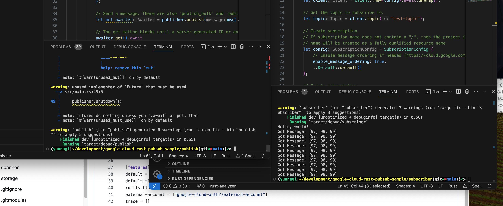

# google-cloud-pubsub

https://github.com/u-na-gi/google-cloud-rust/tree/main/pubsub

こちらを使ってやっていこうと思います

https://github.com/u-na-gi/google-cloud-rust/blob/main/pubsub/docker-compose.yml

pub/sub、ローカルでエミュレータあるの知らなかったなあ

待って認証もあるじゃんこれ
https://github.com/yoshidan/google-cloud-rust/blob/main/foundation/auth/README.md

昨日のyup-oauth2通して結構作る必要あるかなと思ったけどやっぱやってる人はいるもんだね。。。


## サンプルを使ってRustでpubsubしてみる

以下作業ログ

このClientConfigってなんだ??

```Rust
async fn run(config: ClientConfig) -> Result<(), Status> {

    // Create pubsub client.
    let client = Client::new(config).await.unwrap();
```

<br>

ローカルではDefaultが実装されてる。
PUBSUB_EMULATOR_HOSTを環境変数で渡せば良い?

```Rust
#[derive(Debug)]
pub struct ClientConfig {
    /// gRPC channel pool size
    pub pool_size: Option<usize>,
    /// Pub/Sub project_id
    pub project_id: Option<String>,
    /// Runtime project info
    pub environment: Environment,
    /// Overriding service endpoint
    pub endpoint: String,
    /// gRPC connection option
    pub connection_option: ConnectionOptions,
}

/// ClientConfigs created by default will prefer to use `PUBSUB_EMULATOR_HOST`
impl Default for ClientConfig {
    fn default() -> Self {
        let emulator = var("PUBSUB_EMULATOR_HOST").ok();
        let default_project_id = emulator.as_ref().map(|_| "local-project".to_string());
        Self {
            pool_size: Some(4),
            environment: match emulator {
                Some(v) => Environment::Emulator(v),
                None => Environment::GoogleCloud(Box::new(NopeTokenSourceProvider {})),
            },
            project_id: default_project_id,
            endpoint: PUBSUB.to_string(),
            connection_option: ConnectionOptions::default(),
        }
    }
}


```

いや全部書いてたわあ
https://github.com/u-na-gi/google-cloud-rust/tree/main/pubsub#authentication

publish側は静的解析通ったっぽい

そしてローカルで叩いてpub/subに成功


repositoryはこちら
https://github.com/u-na-gi/google-cloud-rust-pubsub-sample

-> 次回は「subscriberはpythonで用意してみる」にします！