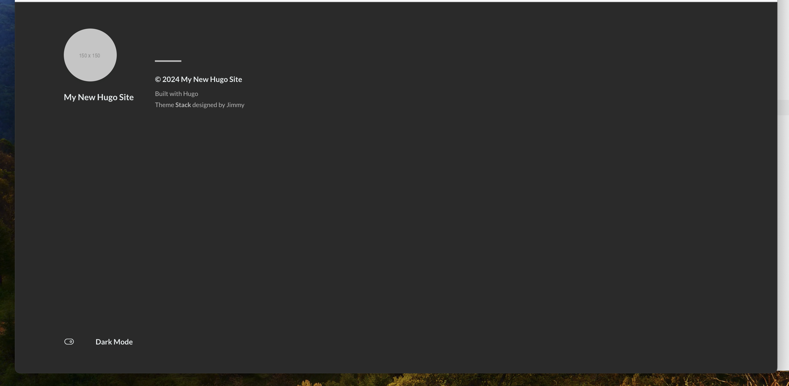
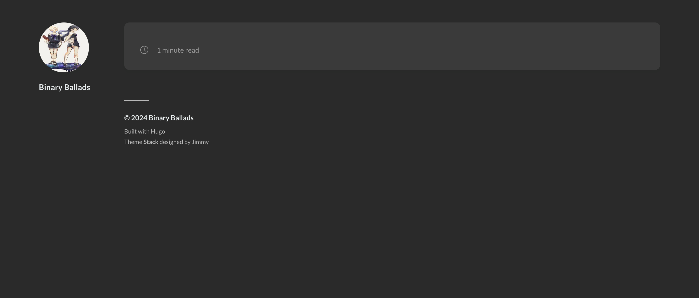

# 今更ながらBlogを始めた。

最初っからおとなしく静的生成してホスティングにしとけばよかったなあ。
このブログはhugoでできています。
hugoはいいね。
何も実装することなくタグ分けも検索も最初から実装されてるのはすごいとしか言えない。
ただ、実はブログ作ろうと思ってからhugoに辿り着くまで紆余曲折がありまして、、、
以下にその過程を記します。


## Ghostの導入とDockerへの切り替え

当初はGhostをブログプラットフォームとして選びましたが、GhostがサポートするNode.jsのバージョンが最新のv18.0.0までだということがわかりました。ホスト環境を汚したくないので、Dockerを使用することに決めました。

GhostのDockerイメージはこちらでメンテナンスされています: https://hub.docker.com/_/ghost


## 自作ブログの構築

私のブログは、Ghostを使用してセルフホストすることにします。使用するDockerイメージは ghost:5.79.0 です。ブログを公開する場所としては、AWSの無料枠を利用する予定です。


## コストと使い勝手を考慮したHugoへの移行

コストを抑えたいという点も重要です。そこで、Hugoを選択しました。Hugoについてはこちらを参照してください: https://gohugo.io/

選んだテーマはこちらです: https://themes.gohugo.io/themes/hugo-theme-stack/

## Hugoのセットアップ

私の環境はIntel MacBook Proです。まだHugoをインストールしていない場合は、以下のコマンドでインストールしてください。

```
brew install hugo 
```

次に、新しいサイトを作成します。

```
//siteを作ります。
hugo new site <レポジトリ名>
cd <レポジトリ名>
git init
```

Gitの初期化でエラーが発生した場合は、この[Stack Overflowの回答](https://stackoverflow.com/questions/15628720/fatal-bad-default-revision-head)を参考にしてください。

テーマを追加し、サーバーを起動します。

```
git commit -m "initial commit"
```

この後に、テーマを適用します。
その後、serverを起動してみます。

サーバーを起動すると、シンプルで洗練された初期ページが表示されます。Hugoのホットリロード機能により、再起動せずに編集が可能です。




## カスタマイズ


**タイトルの変更**:
  - デフォルト状態のタイトルは、`hugo.toml`で変更可能です。

**アバター画像の変更**:
  - アバターの画像は、`themes/hugo-theme-stack/assets/img`配下の画像を使用。
  - `themes/hugo-theme-stack/exampleSite/config.yaml`の`sidebar > avatar`に表示されているパスを書き換えて変更。

しかし、最初の設定だけでは十分ではありませんでした。



元のレポジトリやデモサイトを参照して、必要な設定を見直しました。

- デモサイト: [Hugo Theme Stack Demo](https://dev.stack.jimmycai.com/)
- GitHubレポジトリ: [Hugo Theme Stack Repository](https://github.com/CaiJimmy/hugo-theme-stack/blob/21da06e448fe466ef0a03d1c717847f0eb0049fe/exampleSite/content/post/markdown-syntax/index.md?plain=1#L4)
- starter: https://github.com/CaiJimmy/hugo-theme-stack-starter/tree/master 

## 最終的なブログの形成

日本語のカテゴリー名には対応していないようですが、英語のカテゴリー名は自動的に小文字のケバブケースに変換される様子が見られました。

本当はもっと詳しくみた方がいいんだとは思いますが今回は書けるようになるが目標だったので、、
